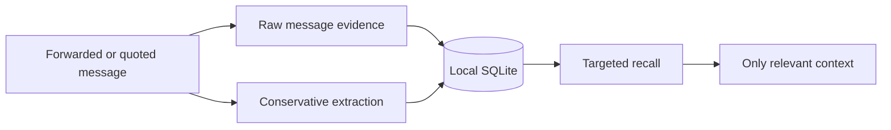

<p align="center">
  <a href="README.md">English</a> · <a href="README.zh-CN.md">简体中文</a>
</p>

<p align="center">
  
</p>

<p align="center">
  <a href="LICENSE"></a>
  
  
  
  
</p>

**Person Memory** is a unified Agent Skill for remembering one person's preferences, wishes, habits, communication patterns, meaningful experiences, and important dates. It keeps the original words as evidence, turns only useful details into compact structured memories, and recalls just what the current conversation needs.

It is local-first, privacy-aware, and deliberately conservative: the goal is to remember a person more faithfully, not to invent a profile about them.

> [!NOTE]
> Person Memory is designed as an agent-independent skill. **Hermes Agent** is the first complete integration included in this repository and can run it as a dedicated independent agent today.

## Why Person Memory

Most agent memory systems are optimized for remembering the user, the task, or the entire conversation. Remembering a particular person calls for a different standard.

- **Evidence over assumption.** Every meaningful memory can point back to the original message, source, and time.
- **Precision over prompt stuffing.** Compact SQLite records are queried by topic instead of injecting a long profile into every model call.
- **Change over permanence.** Temporary states stay temporary, contradictions keep their history, and later evidence can supersede older memories.
- **Ownership over infrastructure.** The database stays local by default and the Python runtime uses no third-party packages.

## How it works



One message produces two complementary layers:

1. `messages` preserves the original text, speaker, source, and timestamp.
2. `memories` stores compact facts with kind, category, confidence, importance, evidence, and optional metadata.

SQLite is the source of truth. Full-text search uses FTS5 when available and falls back to `LIKE`; WAL mode keeps lightweight local use reliable.

## What it remembers

| Area | Examples |
|---|---|
| Preferences | food, drinks, books, fashion, places, dislikes and boundaries |
| Wishes | trips, gifts, activities, films, anime, games and future plans |
| Patterns | habits, communication style and personality evidence |
| Experiences | meaningful events, people, work, study and personal stories |
| Important dates | birthdays, anniversaries, recurring dates and reminders |
| Sensitive calendar data | optional, deliberately supplied cycle dates — never inferred |

The model is open-ended, so agents can add categories without changing the database schema. See [`person-memory/SKILL.md`](person-memory/SKILL.md) for the complete memory contract.

## Designed for any agent, ready for Hermes

The portable core consists of three pieces:

- [`person-memory/SKILL.md`](person-memory/SKILL.md) describes when and how an agent should use the skill.
- [`person_memory.py`](person-memory/scripts/person_memory.py) provides deterministic storage, search, profile, and reminder commands.
- [`triggers.json`](person-memory/triggers.json) and [`trigger.py`](person-memory/scripts/trigger.py) provide optional deterministic routing.

Any agent that can load the skill instructions and invoke a local command can integrate these pieces. The repository currently ships a complete **Hermes independent-agent** setup with an installer, optional soul, example configuration, router rules, and script-only cron reminders.

| Capability | Unified Agent Skill | Hermes integration |
|---|:---:|:---:|
| Skill contract and progressive disclosure | ✓ | ✓ |
| Local SQLite CLI | ✓ | ✓ |
| Deterministic trigger helper | ✓ | ✓ |
| Dedicated agent persona | Agent-specific | Included |
| Installer and example routing | Agent-specific | Included |
| Zero-token scheduled date checks | Scheduler-specific | Included |

## Quick start

### 1. Clone and initialize

```bash
git clone https://github.com/Hubujiu/person-memory.git
cd person-memory
python3 person-memory/scripts/person_memory.py init
```

The default database is `~/.hermes/person-memory/memory.db`. Override it with `--db` when integrating another agent or choosing a different local data directory.

### 2. Register a person

```bash
python3 person-memory/scripts/person_memory.py \
  person-add "她" --aliases "宝贝,女朋友" --relationship partner
```

Use the person's chosen name or alias. Never guess a legal name.

### 3. Remember a message

An agent performs conservative extraction, then sends one JSON document through standard input:

```bash
cat <<'JSON' | python3 person-memory/scripts/person_memory.py remember-json
{
  "person": "她",
  "message": {
    "speaker": "person",
    "content": "我一直特别想去北海道，冬天去看雪。",
    "source": "wechat"
  },
  "memories": [
    {
      "kind": "wish",
      "category": "travel",
      "topic": "destination",
      "value": "北海道",
      "confidence": 1.0,
      "importance": 4,
      "evidence_quote": "我一直特别想去北海道，冬天去看雪。",
      "metadata": {"preferred_season": "冬天", "reason": "看雪"}
    }
  ]
}
JSON
```

The raw message is still preserved when nothing deserves structured extraction.

### 4. Recall only what matters

```bash
PM=person-memory/scripts/person_memory.py

python3 "$PM" recall --person "她" --category food
python3 "$PM" recall --person "她" --kind wish
python3 "$PM" recall --person "她" --query "北海道"
python3 "$PM" search-messages --person "她" --query "北海道"
python3 "$PM" profile --person "她"
```

### Install as a Hermes independent agent

```bash
./hermes/install.sh
```

Optionally copy the dedicated persona when the Hermes profile exists only for Person Memory:

```bash
cp hermes/SOUL.md ~/.hermes/SOUL.md
```

Do not overwrite an existing multi-purpose `SOUL.md` unless that is intentional. See [`hermes/config.example.yaml`](hermes/config.example.yaml) and [`hermes/ROUTER_AGENTS.example.md`](hermes/ROUTER_AGENTS.example.md) for integration examples.

## Memory with restraint

Person Memory does not turn every sentence into a permanent trait.

| Statement | Interpretation |
|---|---|
| “今天突然想吃火锅” | temporary state |
| “我一直都很喜欢火锅” | stable preference |
| “我不吃香菜” | explicit dislike |
| “有机会想去冰岛” | travel wish |
| “我就是比较慢热” | explicit personality evidence |
| one short reply | **not** evidence that the person is introverted |

Explicit statements carry more confidence than guesses. Personality traits require self-description, direct observation from the user, or repeated evidence. When a preference changes, new evidence can supersede the active memory without erasing the history.

## Triggers and routing

Person Memory supports four integration patterns:

1. native semantic skill selection;
2. deterministic keyword and regular-expression routing;
3. an explicit `/person-memory` slash command;
4. a dedicated router-agent convention.

Management and recall intent take priority over ordinary remember phrases, and explicit exclusions such as “不要记” win over every positive match. See **[Trigger modes and integration examples](TRIGGERS.md)** for configuration, precedence, exit codes, and adapter patterns.

## Important dates and daily checks

Run a deterministic check for upcoming dates:

```bash
python3 person-memory/scripts/person_memory.py daily-check --days-ahead 7
```

No output means nothing is due. Hermes can schedule this as a script-only job, avoiding daily LLM token spend:

```bash
./hermes/setup-cron.sh local
```

Cycle tracking is optional sensitive calendar data. It uses only dates deliberately provided by the user or person, never mood, behavior, purchases, or other inferred signals. Its output is an approximate calendar estimate, not medical advice or a prediction.

## Privacy by default

The database can contain another person's conversations, preferences, relationship history, and health-related dates. Treat it accordingly.

- Keep `memory.db`, `memory.db-wal`, and `memory.db-shm` local and out of Git.
- Obtain appropriate consent before retaining another person's private information.
- Do not expose the database to unrelated agents by default.
- Do not infer health, sexual, financial, authentication, or precise-location information.
- Honor update and forget requests by changing the stored records, not merely hiding them in chat.
- Protect synced copies and backups with the same care as the live database.

## Repository layout

```text
person-memory/
├── README.md                 # English homepage
├── README.zh-CN.md           # Simplified Chinese homepage
├── TRIGGERS.md               # Routing and trigger reference
├── assets/                   # Repository artwork
├── person-memory/
│   ├── SKILL.md              # Portable Agent Skill contract
│   ├── triggers.json         # Optional deterministic trigger rules
│   └── scripts/
│       ├── person_memory.py  # SQLite memory CLI
│       └── trigger.py        # Trigger helper
├── hermes/                   # Complete Hermes independent-agent integration
└── tests/                    # Standard-library unit tests
```

## Testing

```bash
python3 -m unittest discover -s tests -v
```

The project uses Python's standard library only; no package installation or database service is required.

## FAQ

<details>
<summary><strong>Does Person Memory require Hermes?</strong></summary>

No. The skill contract, SQLite CLI, and optional trigger helper form the portable core. Hermes is the first complete independent-agent integration shipped with the project.
</details>

<details>
<summary><strong>Does it send memories to a cloud service?</strong></summary>

No. Person Memory itself reads and writes a local SQLite database. The privacy behavior of the agent or model using the skill depends on that agent's configuration.
</details>

<details>
<summary><strong>Why keep both raw messages and structured memories?</strong></summary>

Structured memories make recall small and fast. Raw messages preserve context and evidence, so an answer can be checked against what was actually said.
</details>

<details>
<summary><strong>Is cycle tracking a health prediction?</strong></summary>

No. It is an optional calendar estimate based only on dates and an average supplied deliberately by the user. Real cycles vary.
</details>

## License

[MIT](LICENSE) © Hubujiu
