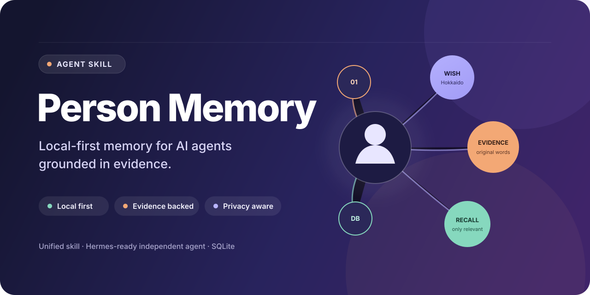
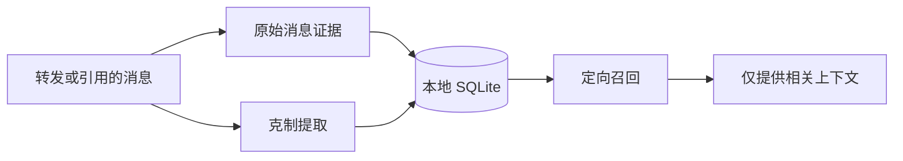

<p align="center">
  <a href="README.md">English</a> · <a href="README.zh-CN.md">简体中文</a>
</p>

<p align="center">
  
</p>

<p align="center">
  <a href="LICENSE"></a>
  
  
  
  
</p>

**Person Memory** 是一个统一的 Agent Skill，用来记住某个人的偏好、愿望、习惯、沟通方式、重要经历和特殊日期。它把原话保留为证据，只将值得长期使用的细节整理成紧凑的结构化记忆，并在对话需要时仅召回相关内容。

它以本地存储和隐私为优先，并且有意保持克制：目标是更忠实地记住一个人，而不是替对方编造一份人物画像。

> [!NOTE]
> Person Memory 的本体是与具体 Agent 无关的统一 Skill。**Hermes Agent** 是仓库当前提供的第一个完整集成，现在即可将它作为独立 Agent 运行。

## 为什么需要 Person Memory

多数 Agent 记忆系统擅长记住用户、任务或整段会话，而持续记住某一个人，需要一套更谨慎的标准。

- **证据优先，而非主观猜测。** 每条重要记忆都可以追溯到原始消息、来源和时间。
- **精确召回，而非塞满提示词。** Agent 按主题查询紧凑的 SQLite 记录，不必在每次模型调用中注入一整份长篇档案。
- **允许变化，而非假设永恒。** 临时状态仍是临时状态；矛盾信息保留历史；新证据可以取代过时记忆。
- **数据归自己，而非依赖基础设施。** 数据库默认只留在本机，Python 运行时没有第三方包依赖。

## 工作原理



一条消息会形成互补的两层数据：

1. `messages` 保存原始文字、说话者、来源和时间。
2. `memories` 保存紧凑事实，包括类型、分类、置信度、重要程度、证据和可选元数据。

SQLite 是唯一事实来源。全文搜索会在可用时使用 FTS5，否则自动回退到 `LIKE`；WAL 模式让轻量本地使用保持可靠。

## 它能记住什么

| 领域 | 示例 |
|---|---|
| 偏好 | 食物、饮料、书籍、穿搭、地点、不喜欢的事物与边界 |
| 愿望 | 旅行、礼物、活动、电影、动漫、游戏与未来计划 |
| 行为模式 | 习惯、沟通方式和有证据的人格特征 |
| 经历 | 重要事件、人际关系、工作、学习与个人故事 |
| 重要日期 | 生日、纪念日、周期性日期与提醒 |
| 敏感日历数据 | 可选且由用户主动提供的生理周期日期——绝不推断 |

记忆模型是开放的，Agent 无需修改数据库结构即可增加分类。完整记忆契约参见 [`person-memory/SKILL.md`](person-memory/SKILL.md)。

## 面向所有 Agent，为 Hermes 完整就绪

可移植的核心由三部分组成：

- [`person-memory/SKILL.md`](person-memory/SKILL.md) 说明 Agent 应当在何时、如何使用该技能。
- [`person_memory.py`](person-memory/scripts/person_memory.py) 提供确定性的存储、搜索、档案和提醒命令。
- [`triggers.json`](person-memory/triggers.json) 与 [`trigger.py`](person-memory/scripts/trigger.py) 提供可选的确定性路由。

任何能够载入 Skill 指令并调用本地命令的 Agent，都可以集成这些组件。仓库目前还提供了完整的 **Hermes 独立 Agent** 方案，包括安装脚本、可选人格、配置示例、路由规则和纯脚本定时提醒。

| 能力 | 统一 Agent Skill | Hermes 集成 |
|---|:---:|:---:|
| Skill 契约与渐进式披露 | ✓ | ✓ |
| 本地 SQLite CLI | ✓ | ✓ |
| 确定性触发辅助程序 | ✓ | ✓ |
| 独立 Agent 人格 | 由 Agent 决定 | 已提供 |
| 安装器与路由示例 | 由 Agent 决定 | 已提供 |
| 零模型 Token 的日期检查 | 由调度器决定 | 已提供 |

## 快速开始

### 1. 克隆并初始化

```bash
git clone https://github.com/Hubujiu/person-memory.git
cd person-memory
python3 person-memory/scripts/person_memory.py init
```

默认数据库位于 `~/.hermes/person-memory/memory.db`。集成其他 Agent 或希望使用不同本地目录时，可以通过 `--db` 覆盖。

### 2. 登记一个人

```bash
python3 person-memory/scripts/person_memory.py \
  person-add "她" --aliases "宝贝,女朋友" --relationship partner
```

请使用对方认可的名字或称呼，不要猜测法定姓名。

### 3. 记住一条消息

Agent 完成克制提取后，通过标准输入发送一份 JSON：

```bash
cat <<'JSON' | python3 person-memory/scripts/person_memory.py remember-json
{
  "person": "她",
  "message": {
    "speaker": "person",
    "content": "我一直特别想去北海道，冬天去看雪。",
    "source": "wechat"
  },
  "memories": [
    {
      "kind": "wish",
      "category": "travel",
      "topic": "destination",
      "value": "北海道",
      "confidence": 1.0,
      "importance": 4,
      "evidence_quote": "我一直特别想去北海道，冬天去看雪。",
      "metadata": {"preferred_season": "冬天", "reason": "看雪"}
    }
  ]
}
JSON
```

即使没有任何内容值得提取为结构化记忆，原始消息仍会保留。

### 4. 只召回当前需要的内容

```bash
PM=person-memory/scripts/person_memory.py

python3 "$PM" recall --person "她" --category food
python3 "$PM" recall --person "她" --kind wish
python3 "$PM" recall --person "她" --query "北海道"
python3 "$PM" search-messages --person "她" --query "北海道"
python3 "$PM" profile --person "她"
```

### 安装为 Hermes 独立 Agent

```bash
./hermes/install.sh
```

如果这个 Hermes 配置只用于 Person Memory，可以选择复制专用人格：

```bash
cp hermes/SOUL.md ~/.hermes/SOUL.md
```

除非确实希望替换，否则不要覆盖现有多用途配置的 `SOUL.md`。集成示例参见 [`hermes/config.example.yaml`](hermes/config.example.yaml) 和 [`hermes/ROUTER_AGENTS.example.md`](hermes/ROUTER_AGENTS.example.md)。

## 克制地形成记忆

Person Memory 不会把每句话都变成永久特征。

| 原话 | 解释方式 |
|---|---|
| “今天突然想吃火锅” | 临时状态 |
| “我一直都很喜欢火锅” | 稳定偏好 |
| “我不吃香菜” | 明确不喜欢 |
| “有机会想去冰岛” | 旅行愿望 |
| “我就是比较慢热” | 明确的人格证据 |
| 一次简短回复 | **不能**证明对方内向 |

明确表述比猜测拥有更高置信度。人格特征必须来自自我描述、用户的直接观察，或多次重复出现的证据。偏好发生变化时，新证据可以替代当前有效记忆，同时保留历史。

## 触发与路由

Person Memory 支持四种集成方式：

1. 原生语义化 Skill 选择；
2. 确定性的关键词与正则路由；
3. 显式 `/person-memory` 斜杠命令；
4. 专用 Router Agent 约定。

管理和召回意图优先于普通的“记住”短语；“不要记”等显式排除语句优先于所有正向匹配。配置、优先级、退出码和适配器示例参见 **[触发模式与集成说明](TRIGGERS.md)**。

## 重要日期与每日检查

使用确定性脚本检查近期日期：

```bash
python3 person-memory/scripts/person_memory.py daily-check --days-ahead 7
```

没有输出就表示当前无需提醒。Hermes 可以把它安排为纯脚本任务，避免每天消耗 LLM Token：

```bash
./hermes/setup-cron.sh local
```

生理周期跟踪是可选的敏感日历数据，只使用用户或当事人主动提供的日期，绝不根据情绪、行为、消费或其他信号进行推断。输出只是近似日历估算，不构成医疗建议或预测。

## 隐私优先

数据库可能包含另一个人的聊天内容、偏好、关系经历和健康相关日期，请以相应级别保护它。

- 将 `memory.db`、`memory.db-wal` 和 `memory.db-shm` 留在本地并排除在 Git 之外。
- 保存他人隐私信息前，应获得适当同意。
- 默认不要把数据库暴露给无关 Agent。
- 不要推断健康、性、财务、身份认证或精确位置等信息。
- 收到更新或遗忘请求时，应修改存储记录，而不是只在对话里隐藏。
- 同步副本和备份需要获得与在线数据库相同的保护。

## 仓库结构

```text
person-memory/
├── README.md                 # 英文首页
├── README.zh-CN.md           # 简体中文首页
├── TRIGGERS.md               # 路由与触发参考
├── assets/                   # 仓库视觉素材
├── person-memory/
│   ├── SKILL.md              # 可移植 Agent Skill 契约
│   ├── triggers.json         # 可选的确定性触发规则
│   └── scripts/
│       ├── person_memory.py  # SQLite 记忆 CLI
│       └── trigger.py        # 触发辅助程序
├── hermes/                   # 完整的 Hermes 独立 Agent 集成
└── tests/                    # 标准库单元测试
```

## 测试

```bash
python3 -m unittest discover -s tests -v
```

项目只使用 Python 标准库，不需要安装软件包或启动数据库服务。

## 常见问题

<details>
<summary><strong>Person Memory 必须配合 Hermes 使用吗？</strong></summary>

不需要。Skill 契约、SQLite CLI 和可选触发辅助程序组成了可移植核心。Hermes 是项目当前提供的第一个完整独立 Agent 集成。
</details>

<details>
<summary><strong>它会把记忆发送到云端吗？</strong></summary>

不会。Person Memory 本身只读写本地 SQLite 数据库。使用该 Skill 的 Agent 或模型如何处理隐私，取决于相应 Agent 的配置。
</details>

<details>
<summary><strong>为什么同时保存原始消息和结构化记忆？</strong></summary>

结构化记忆让召回保持小而快；原始消息则保留上下文和证据，便于核对回答与当时真实说法是否一致。
</details>

<details>
<summary><strong>生理周期跟踪属于健康预测吗？</strong></summary>

不属于。它只是可选的日历估算，仅根据用户主动提供的日期和平均周期计算，实际周期会发生变化。
</details>

## 许可证

[MIT](LICENSE) © Hubujiu
